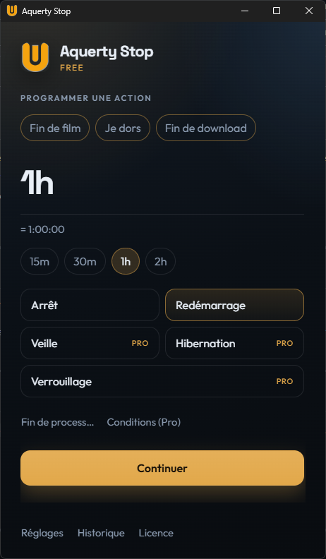
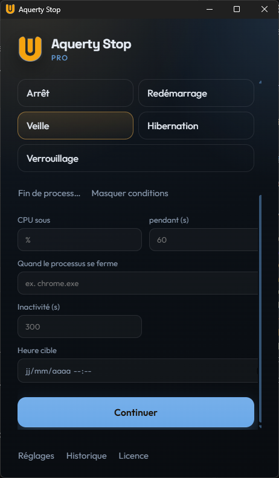
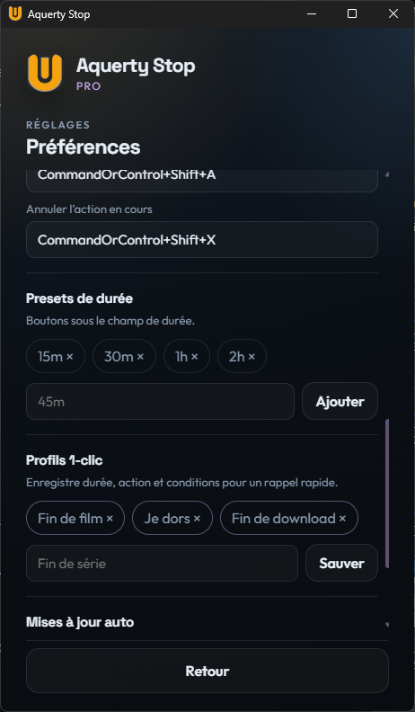

# Aquerty Stop

Programme l’arrêt, le redémarrage, la veille, l’hibernation ou le verrouillage de ton PC Windows. Un timer simple, des profils en 1 clic, et des options Pro si tu en as besoin.

**Windows 10 / 11** · Gratuit pour démarrer · Pro en option

[Télécharger](https://github.com/STAELH81/aquerty-desktop/releases/latest) · [Site](https://staelh81.github.io/aquerty-desktop/) · [Acheter Pro](https://staelh.gumroad.com/l/ulrmc)

---

## À quoi ça sert

Tu lances un compte à rebours, tu choisis l’action, tu fais autre chose. Aquerty Stop s’occupe de la suite.

Idéal pour : fin de téléchargement, fin de rendu, “je m’endors devant mon PC”, ou juste éteindre le PC dans 30 minutes sans y penser.

---

## Captures

> Remplace les fichiers dans `docs/screenshots/` (mêmes noms) pour que les images s’affichent ici et sur Gumroad.

---

## Installation

1. Va sur la [dernière release](https://github.com/STAELH81/aquerty-desktop/releases/latest)
2. Télécharge le fichier **`.exe`** (installeur NSIS)
3. Installe, lance **Aquerty Stop**
4. Windows peut demander une confirmation SmartScreen la première fois : *Informations complémentaires* → *Exécuter quand même* (normal pour un petit éditeur indépendant)

Les mises à jour peuvent se faire depuis l’app (réglages), via les releases GitHub.

---

## Fonctionnalités

### Gratuit
- Timer (ex. `30m`, `1h30`, `45`)
- Arrêt et redémarrage
- Presets de durée
- Profils 1-clic (limités)
- Historique
- Démarrage avec Windows (option)
- Mises à jour auto

### Pro
- Veille, hibernation, verrouillage
- Conditions (CPU bas, processus terminé, etc.)
- Plus de presets et de profils

**Pro lifetime :** [9,99 €](https://staelh.gumroad.com/l/ulrmc)  
**Pro annuel :** [2,99 € / an](https://staelh.gumroad.com/l/fwywzf)

Après achat, tu reçois une clé. Colle-la dans l’app → *Licence*.

---

## Utilisation rapide

1. Choisis une durée
2. Choisis une action
3. Lance
4. Annule quand tu veux avec le bouton d’annulation

Astuce : sauvegarde un profil (durée + action) pour le relancer en un clic.

---

## FAQ

**Ça marche hors ligne ?**  
Oui. La licence Pro est vérifiée localement. Internet sert surtout aux mises à jour et à l’achat.

**C’est dangereux ?**  
L’app programme des actions Windows classiques (arrêt, veille…). Tu peux toujours annuler avant la fin du timer.

**Où sont mes réglages ?**  
Dans les données locales de l’app Windows (pas besoin d’un compte).

**Bug / question ?**  
Ouvre une [issue GitHub](https://github.com/STAELH81/aquerty-desktop/issues) ou contacte-moi via Gumroad après un achat.

---

## Licence du code

Code source sur ce dépôt. L’usage de l’app Free / Pro suit les conditions d’achat (Gumroad) pour la version Pro.
